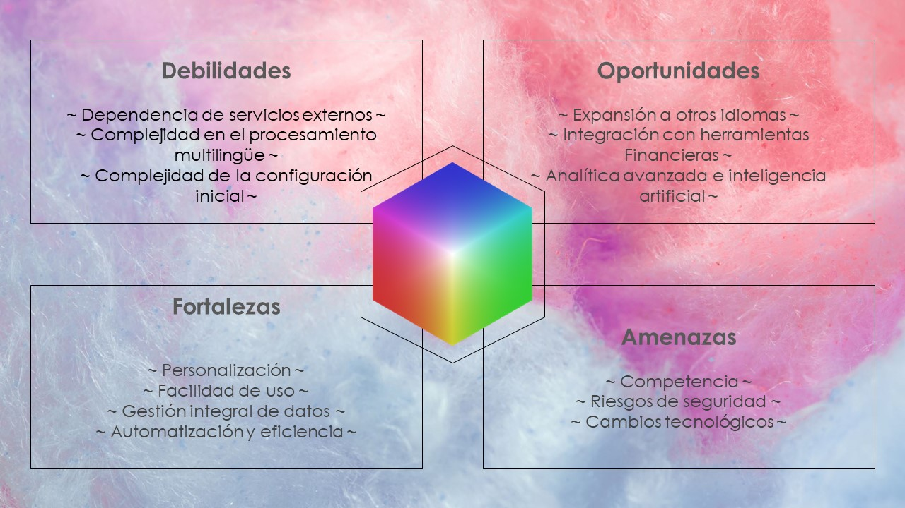

# Light Color's Diagnostico

## Justificacion

En el contexto actual, donde la eficiencia y el control financiero son factores clave para el éxito de cualquier negocio, la implementación de herramientas tecnológicas sencillas y efectivas se vuelve esencial. Para "Light Colors", una peluquería comprometida con la sostenibilidad y la belleza natural, contar con el Passive Expenses Bot es una oportunidad única para optimizar la gestión financiera, lo que asegura un crecimiento organizado y controlado.

Incremento en la Eficiencia Financiera Una encuesta reciente de la National Small Business Association indica que el 64% de las pequeñas empresas experimentan problemas financieros debido a una gestión ineficaz de sus flujos de caja. Para un negocio como "Light Colors", que busca reducir el impacto ambiental mientras opera con un enfoque basado en productos y servicios naturales, un control eficiente de los gastos es clave para su sostenibilidad. El Passive Expenses Bot automatiza la gestión de gastos pasivos, permitiendo a los gerentes monitorear en tiempo real las salidas de dinero, evitando errores humanos y optimizando los recursos.
Al permitir a los usuarios registrar gastos de manera automática y sencilla, el bot reduce la carga administrativa. Esto es particularmente importante en pequeñas empresas, donde el tiempo es limitado y cada hora cuenta para el éxito operativo. Según estudios, las empresas que automatizan sus procesos de gestión financiera experimentan hasta un 30% de ahorro en tiempo y costos administrativos, lo que directamente beneficia la eficiencia del negocio.

Adaptación Multilingüe y Asequibilidad Uno de los aspectos más destacados del Passive Expenses Bot es su capacidad de comprender y operar en dos idiomas (inglés y español), eliminando barreras lingüísticas y adaptándose al entorno multicultural en el que puede desenvolverse "Light Colors". Este nivel de accesibilidad también mejora la comunicación interna y garantiza que cualquier miembro del equipo pueda interactuar con la herramienta sin dificultades, independientemente de su idioma nativo.
Además, a través del procesamiento de lenguaje natural (NLP), el bot no solo procesa comandos estructurados, sino también mensajes en un lenguaje más cotidiano, lo que facilita la interacción. Un informe de Salesforce afirma que el 84% de las empresas que priorizan la experiencia del cliente reportan un aumento en ingresos. Al hacer que la gestión financiera sea más intuitiva y accesible, el bot refuerza el enfoque centrado en la facilidad de uso y la satisfacción del equipo administrativo.

Mejora en el Control del Flujo de Caja y Presupuesto La estabilidad financiera es fundamental para la supervivencia y el crecimiento de cualquier negocio. Se estima que el 82% de las pequeñas empresas fracasan debido a problemas de flujo de caja (U.S. Bank study). Con el Passive Expenses Bot, "Light Colors" puede monitorear los gastos de manera eficiente y proactiva, asegurándose de que cada salida de dinero esté alineada con su presupuesto, reduciendo el riesgo de errores o gastos excesivos.
El bot permite establecer límites presupuestarios, lo que ofrece a los administradores notificaciones cuando el negocio se acerque o sobrepase los límites establecidos, proporcionando un control adicional para garantizar que los recursos financieros se utilicen de manera inteligente. Esta característica también refuerza el compromiso de "Light Colors" con la sostenibilidad financiera, al permitir que los gastos se mantengan dentro de un marco organizado y predecible.

Exportación de Datos para Análisis Externo El 76% de las pequeñas empresas que utilizan análisis financieros regulares reportan mejoras en la toma de decisiones (Deloitte). El Passive Expenses Bot permite a "Light Colors" exportar datos financieros en formato CSV, lo que facilita el análisis externo y la revisión detallada del flujo de caja. Este nivel de acceso a datos permite a la empresa ajustar sus estrategias de gasto en tiempo real, tomar decisiones basadas en datos y planificar expansiones futuras con mayor precisión.

Automatización y Sostenibilidad del Tiempo Un estudio de McKinsey & Company revela que la automatización de tareas rutinarias puede ahorrar hasta un 45% del tiempo de trabajo en tareas administrativas, lo que permite a los empleados enfocarse en actividades que realmente agregan valor. En "Light Colors", donde el foco está en la atención al cliente y la calidad del servicio, cada minuto adicional que se dedica al negocio puede mejorar la experiencia del cliente y, en última instancia, aumentar los ingresos. El Passive Expenses Bot permite registrar, organizar y visualizar gastos de manera automática, lo que libera tiempo valioso para que el equipo de la peluquería pueda concentrarse en lo que realmente importa: ofrecer un servicio excepcional.

Crecimiento Escalable y Preparación para el Futuro A medida que "Light Colors" crece, la necesidad de una gestión financiera sólida y escalable es crucial. El Passive Expenses Bot ofrece una solución flexible que puede evolucionar junto con el negocio. La capacidad de adaptarse a nuevas necesidades a través de futuras integraciones, como herramientas de planificación financiera o la expansión del soporte a otros idiomas, garantiza que la herramienta seguirá siendo relevante y útil a medida que la peluquería crezca. Esta escalabilidad permitirá a "Light Colors" mantener un control financiero claro y eficiente sin importar cuán grande o compleja se vuelva su operación.

## DOFA

### Fortalezas

. **Facilidad de uso**
  - **Interfaz fácil de usar:** El bot funciona en una plataforma conocida (Discord), por lo que es accesible para usuarios con distintos niveles de conocimientos técnicos.
  - **Soporte multilingüe:** La capacidad del bot para funcionar tanto en inglés como en español amplía su accesibilidad y el alcance de los usuarios.
  - **Procesamiento del Lenguaje Natural:** Utiliza modelos NLU (SpaCy o NLTK) para entender y procesar las entradas del usuario, mejorando la experiencia del usuario a través de una interacción intuitiva.

. **Automatización y eficiencia**
  - **Informes automatizados:** Genera resúmenes y perspectivas en lenguaje natural, ahorrando tiempo y esfuerzo en el análisis financiero manual.
  - **Corrección de errores:** Corrige automáticamente los errores de entrada, garantizando la precisión y fiabilidad de los datos.

. **Gestión integral de datos**
  - **Sistemas integrados:** Se integra perfectamente con APIs y servicios externos, asegurando un flujo y procesamiento de datos fluido.
  - **Almacenamiento seguro:** Utiliza una base de datos SQLite para un almacenamiento de datos seguro y fiable.
  - **Copia de seguridad y exportación de datos:** Admite funciones de copia de seguridad y exportación de datos, lo que permite a los usuarios conservar y analizar sus datos externamente.

. **Personalización**
  - **Información personalizada:** Proporciona información financiera personalizada basada en los patrones de gasto del usuario, ayudando en la gestión financiera personal.
  - **Preferencias del usuario:** Ajusta las respuestas en función de las preferencias del usuario, incluidos el lenguaje, el tono (formal, informal, humorístico) y el estilo de interacción.

### Debilidades

. **Dependencia de servicios externos:**
  - Fiabilidad:** La funcionalidad del bot puede verse afectada por la disponibilidad y fiabilidad de APIs y servicios externos.

. **Complejidad en el procesamiento multilingüe:**
  - Desafíos específicos de cada idioma:** El manejo de expresiones idiomáticas, matices culturales y variaciones en las estructuras lingüísticas puede añadir complejidad al procesamiento del lenguaje natural.

. **Complejidad de la configuración inicial:**
  - Curva de aprendizaje:** Aunque el bot ofrece una interfaz fácil de usar, los usuarios pueden enfrentarse a una curva de aprendizaje durante la configuración inicial, especialmente si no están familiarizados con los bots de Discord.

### Oportunidades
. **Expansión a otros idiomas:**
  - **Ampliación de la base de usuarios:** La ampliación del soporte multilingüe a otros idiomas puede atraer a una base de usuarios más diversa.
  - **Mayor personalización:** Pueden introducirse otras opciones de personalización, como el asesoramiento financiero regional, para atender a grupos demográficos específicos.

. **Integración con herramientas financieras**
  - **Gestión financiera avanzada:** La integración con herramientas y servicios populares de planificación financiera puede ampliar la funcionalidad del bot, ofreciendo a los usuarios opciones de gestión financiera más completas.

. **Analítica avanzada e inteligencia artificial**
  - **Información predictiva:** La incorporación de IA avanzada y modelos de aprendizaje automático puede proporcionar a los usuarios información predictiva, ayudándoles a tomar decisiones financieras informadas.

### Amenazas

. **Competencia**
  - **Saturación del mercado:** El creciente número de herramientas y aplicaciones de gestión financiera puede suponer una competencia significativa, que obligue al bot a ofrecer propuestas de valor únicas para destacar.

. **Riesgos de seguridad**
  - **Privacidad de los datos:** Como ocurre con cualquier aplicación que maneje datos financieros personales, garantizar la privacidad y la seguridad de los datos es fundamental. Cualquier infracción podría dañar la reputación del bot y la confianza de los usuarios.

. **Cambios tecnológicos**
  - **Cambios en las API:** Los cambios en las API de los servicios externos pueden alterar la funcionalidad del bot, lo que requiere actualizaciones y mantenimiento constantes.
  - **Avances en NLP:** El rápido ritmo de los avances en el procesamiento del lenguaje natural puede requerir actualizaciones frecuentes para seguir siendo competitivo y eficaz.

